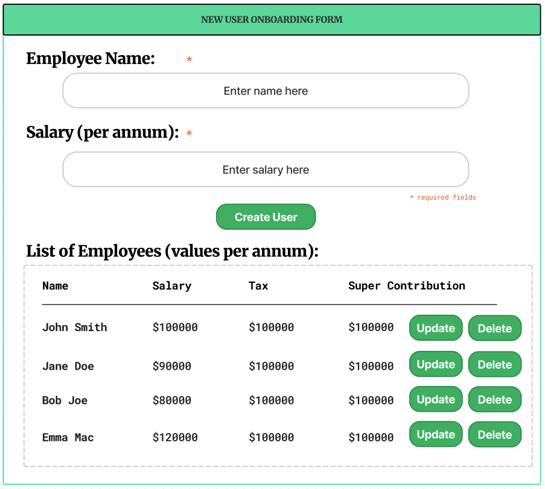
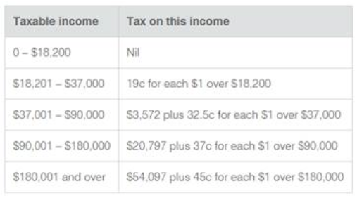

# Income, Tax & Superannuation Calculator


## Exercise

A bank would like to onboard a new staff member who has just been recruited.
As part of this process, the bank would like to send the new staff member an electronic form to complete.
This form needs to capture the information required to set up the staff member in their payroll and HR systems.
However, their payroll systems has a major limitation - it can’t calculate an individual’s annual tax nor their annual
superannuation contributions.

Therefore, the onboarding process needs to calculate these numbers.

In order to satisfy the demands of the bank, a solution has been proposed.

## User Stories

_As an engineer, a design for the new onboarding form must be created. The form visually represents the user creation
flow of the HR system. The scope of the MVP requires only the employee's full name and their salary, with the results of
the calculation being displayed for each new user being created._

_As a user onboarding a new employee within the hiring system, providing an income value, the program will return the
tax and superannuation contributions for new employee's salary bracket._

## Requirements

The bank would like the following:

1. A design for the new onboarding form
2. A simple program which can calculate the annual tax and superannuation for a given salary amount

## Design

A design has been created to visually represent the function of the new employee onboarding form.
To achieve the MVP of the solution as soon as possible, the only required fields are the employee's name and salary.
Once these required fields are entered and the user selects 'create', the user will be onboarded into the system with
their details displayed accordingly: 'name', 'salary', 'taxable income', 'superannuation contributions'.




## Project Structure

```
income-calculator
├── pom.xml
├── README.md
├── resources
|   └── form_design.png
|   └── tax_bracket_table.png
└── src
    ├── Main.java
    ├── entities
    │   └── Employee.java
    ├── services
    │   └── NewEmployeeService.java
    │   └── TaxSuperCalculatorHelper.java
    └── test
        └── EmployeeServiceTest.java
```
## Getting Started

- Prerequisites
- Installation

## Usage

## Testing

Simple unit tests have been created to assert that the behaviour and logic of the program produces an expected result.
'Happy' and 'unhappy' code paths are provided to cover invalid user entry.
Tax bracket calculation is based off the provided criteria below:



### Testing Tools Used

- IntelliJ Static Code Analysis
- Unit tests written with JUnit 5
- 

## Future Developement Beyond MVP

Given the time restrictions to complete this task, items beyond creating an MVP for the client remain and may still be worked on in the future.
Several improvements and future features have been identified and listed below:
- Code Coverage Reporting
- Additional Edge Case Tests
- Develop Front-End Component
- Implement Full RESTful API for Managing Employees
- Explore Alternative Algorithms for Tax Calculation
- Database Connectivity
- Data Mocking for Testing

## License


## Acknowledgements

Tax calculation test criteria provided by the ATO - residential tax rates for 2019-20.
Note: income tax result is inclusive of medicare.
Source: [ATO](https://www.ato.gov.au/Rates/Individual-income-tax-for-prior-years/)